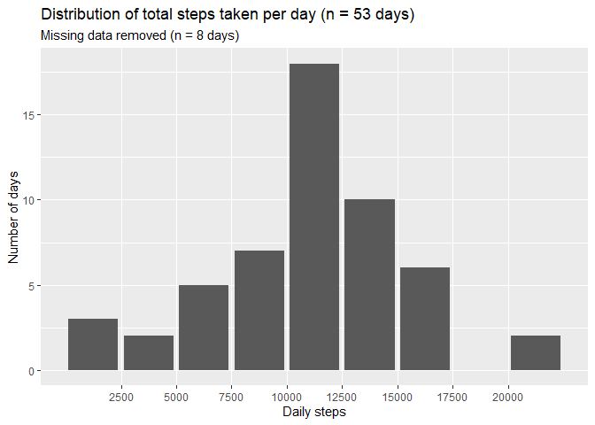
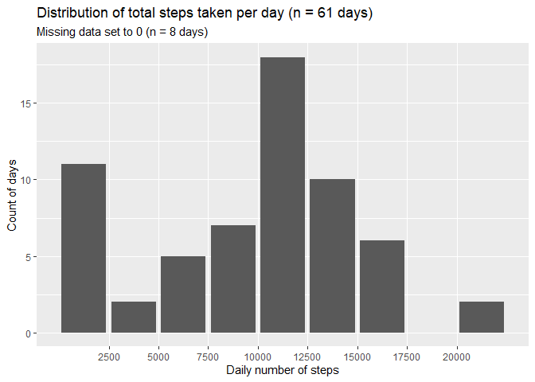
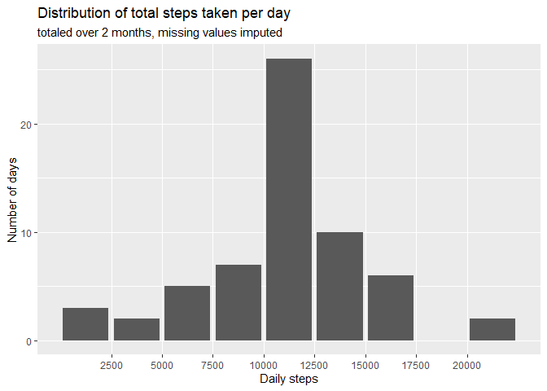
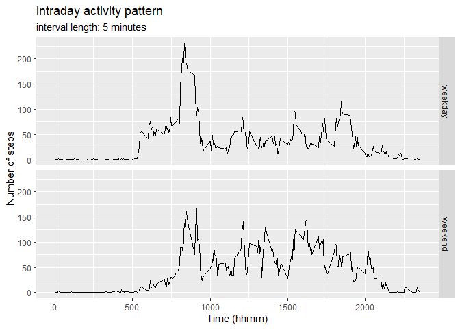

## Uwe Draeger


## Introduction


```
## -- Attaching packages --------------------------------------- tidyverse 1.3.0 --
```

```
## v ggplot2 3.3.2     v purrr   0.3.4
## v tibble  3.0.4     v dplyr   1.0.2
## v tidyr   1.1.2     v stringr 1.4.0
## v readr   1.4.0     v forcats 0.5.0
```

```
## Warning: package 'tibble' was built under R version 4.0.3
```

```
## -- Conflicts ------------------------------------------ tidyverse_conflicts() --
## x dplyr::filter() masks stats::filter()
## x dplyr::lag()    masks stats::lag()
```

```
## Warning: package 'lubridate' was built under R version 4.0.3
```

```
## 
## Attaching package: 'lubridate'
```

```
## The following objects are masked from 'package:base':
## 
##     date, intersect, setdiff, union
```

This assignment is a component of the "Reproducible Research" course by Johns Hopkins University on Coursera. 

It is now possible to collect a large amount of data about personal movement using activity monitoring devices. These type of devices are part of the "quantified self" movement - a group of enthusiasts who take measurements about themselves regularly to improve their health, to find patterns in their behavior, or because they are tech geeks. But these data remain under-utilized both because the raw data are hard to obtain and there is a lack of statistical methods and software for processing and interpreting the data.

This assignment makes use of data from a personal activity monitoring device. This device collects data at 5 minute intervals through out the day. The data consists of two months of data from an anonymous individual collected during the months of October and November, 2012 and include the number of steps taken in 5 minute intervals each day.

The raw data was provided as part of the course work. 
The repository is forked from [GitHub](http://github.com/rdpeng/RepData_PeerAssessment1).


## Loading and preprocessing the data


```r
unzip(zipfile = "activity.zip")
activity <- read.csv2("activity.csv", sep = ",", na.strings = "NA")
activity <- activity %>% mutate(date = ymd(as.character(date)))
```


```r
str(activity) #17568 observations
```

'data.frame':	17568 obs. of  3 variables:
 $ steps   : int  NA NA NA NA NA NA NA NA NA NA ...
 $ date    : Date, format: "2012-10-01" "2012-10-01" ...
 $ interval: int  0 5 10 15 20 25 30 35 40 45 ...

```r
numdays <- unique(activity$date) # 61 days
numintervals <- unique(activity$interval) # 288 intervals 

# 288 intervals x 61 days = 17568 observations

summary(activity)
```

     steps           date               interval   
 Min.   :  0    Min.   :2012-10-01   Min.   :   0  
 1st Qu.:  0    1st Qu.:2012-10-16   1st Qu.: 589  
 Median :  0    Median :2012-10-31   Median :1178  
 Mean   : 37    Mean   :2012-10-31   Mean   :1178  
 3rd Qu.: 12    3rd Qu.:2012-11-15   3rd Qu.:1766  
 Max.   :806    Max.   :2012-11-30   Max.   :2355  
 NA's   :2304                                      

```r
# 2304 NA
```


```r
# create tibble with total number of steps per day
totalsteps <- activity %>% 
        group_by(date) %>% 
        summarise(total = sum(steps, na.rm = TRUE))
```

```
## `summarise()` ungrouping output (override with `.groups` argument)
```

```r
totalsum <- sum(totalsteps$total, na.rm = TRUE)
totalmean <- mean(totalsteps$total, na.rm = TRUE)
totalmedian <- median(totalsteps$total, na.rm = TRUE)
totalmin <- min(totalsteps$total, na.rm = TRUE)
totalmax <- max(totalsteps$total, na.rm = TRUE)
```


```r
# create tibble with total number of steps per day
omittedsteps <- activity %>% 
        filter(!is.na(steps)) %>%
        group_by(date) %>% 
        summarise(total = sum(steps))
```

```
## `summarise()` ungrouping output (override with `.groups` argument)
```

```r
omittedsum <- sum(omittedsteps$total)
omittedmean <- mean(omittedsteps$total)
omittedmedian <- median(omittedsteps$total)
omittedmin <- min(omittedsteps$total)
omittedmax <- max(omittedsteps$total)
```


## What is mean total number of steps taken per day?

At first, we take a look at the activities.

Over the observation period, only 53 out of 61 days had data.
A total number of 570608 steps were recorded. 

The daily activity was not spread evenly across the period. The daily average was 10766.19 (or 9354.23 for 61 days) steps. The median number of steps taken was 10765 (10395 for 61 days). However, the daily number of steps taken varied widely, with a minimum of 41 and a maximum of 21194 steps.

The below chart shows the distribution of daily activity. 


```r
# plot a histogram of total number of steps taken each day
ggplot(omittedsteps,aes(total)) +
        geom_bar() + 
        scale_x_binned() + 
        labs(x = "Daily steps", y = "Number of days", 
             title = "Distribution of total steps taken per day (n = 53 days)",
             subtitle = "Missing data removed (n = 8 days)")
```

<!-- -->

The same chart with 61 days, i.e. missing observations are set to 0.


```r
# plot a histogram of total number of steps taken each day
ggplot(totalsteps,aes(total)) +
        geom_bar(na.rm = TRUE) + 
        scale_x_binned() + 
        labs(x = "Daily number of steps", y = "Count of days", 
             title = "Distribution of total steps taken per day (n = 61 days)",
             subtitle = "Missing data set to 0 (n = 8 days)")
```

<!-- -->

```r
# Raw data NAs show up in the first bin, as set to 0.
# Would have been better to remove them from the sample before creating the plot. However, the instructions stated these could be ignored.
```


## What is the average daily activity pattern?

In a next step we take a look at the activity pattern over the course of an average day.
As can be seen, the activities start shortly after 5:00am, peak around 8:30am, start to calm down around 7:00pm, only to get close to zero around 10:00 pm.


```r
# create tibble with mean number of steps per interval
intraday <- activity %>%
        group_by(interval) %>%
        summarise(intra = mean(steps, na.rm = TRUE))
```

```
## `summarise()` ungrouping output (override with `.groups` argument)
```

```r
# plot a histogram of total number of steps taken each day
ggplot(intraday,aes(x = interval, y = intra)) +
        geom_line(na.rm = TRUE) + 
        labs(x = "Time (hhmm)", y = "Number of steps", 
             title = "Intraday activity pattern",
             subtitle = "interval length: 5 minutes")
```

<!-- -->


```r
# find most active period
maxsteps <- intraday %>%
        filter(intra == max(intra)) %>%
        mutate(stunde = interval %/% 100, minute = interval %% 100)
```
The most active 5-minute-interval starts 8 : 35.


## Imputing missing values

In a next step we consider another treatment of missing values and their potential effects on the results. Missing values will be replaced by the mean activity in each interval.


```r
totalnum <- sum(is.na(activity$steps))

# create tibble to analyze missing values
miss <- activity %>%
        filter(is.na(steps)) 

miss_days <- miss %>%
        group_by(date) %>% 
        count(date) 
# 8 days with 288 intervals each = 2304 observations are completely missing.
```

There are in total 2304 intervals with missing observations. For eight days all values are missing. No missing data is recorded for intervals on other days.


```r
# create new dataset where NAs are replaced with interval mean 
imputed <- activity %>% 
        group_by(interval) %>%
        mutate(steps = replace(steps, is.na(steps), mean(steps, na.rm = TRUE)))

# From here on missing values initially set to 0 have been replaced 
# create tibble with total number of steps per day
totalimputed <- imputed %>% 
        group_by(date) %>% 
        summarise(total = sum(steps))
```

```
## `summarise()` ungrouping output (override with `.groups` argument)
```

```r
imputedmean <- mean(totalimputed$total) 
imputedmedian <-  median(totalimputed$total) 
```


```r
# plot a histogram of total number of steps taken each day
ggplot(totalimputed,aes(total)) +
        geom_bar() + 
        scale_x_binned() + 
        labs(x = "Daily steps", y = "Number of days", 
             title = "Distribution of total steps taken per day",
             subtitle = "totaled over 2 months, missing values imputed")
```

<!-- -->

As one would expect, replacing missing values with the mean of the non-missing values moves observations to center of the distribution. Replacing missing values with mean of non-missing values leads to different results compared to both setting them to 0 or to remove them from the sample. It is worth keeping this in mind when drawing conclusions from the data. 

The mean number of steps when missing data has been "corrected" this way is 10766.19, equal to the result achieved by removing them from the sample. The new median number of steps with imputed data, however is changed to 10766.19. The identity of the median with the mean is a consequence of our data manipulation.


## Are there differences in activity patterns between weekdays and weekends?

The activity pattern is different between weekdays (Mon - Fri) and weekends (Sat, Sun).
The peak of activities in the morning that dominates the pattern on weekdays can not be observed on weekends. Generally, the activities are more evenly spread on the weekends.   


```r
imputed <- imputed %>%
        mutate(weekday = if_else(
                wday(date,week_start = getOption("lubridate.week.start", 1)) > 5, 
                "weekend", 
                "weekday"))
```


```r
imputedintraday <- imputed %>%
        group_by(interval, weekday) %>%
        summarise(intra = mean(steps, na.rm = TRUE))
```

```
## `summarise()` regrouping output by 'interval' (override with `.groups` argument)
```

```r
ggplot(imputedintraday, aes(x = interval, y = intra )) +
        geom_line() + 
        facet_grid((rows = vars(weekday))) +
        labs(x = "Time (hhmm)", y = "Number of steps", 
             title = "Intraday activity pattern",
             subtitle = "interval length: 5 minutes")
```

<!-- -->


```r
sessionInfo()
```

R version 4.0.2 (2020-06-22)
Platform: x86_64-w64-mingw32/x64 (64-bit)
Running under: Windows 10 x64 (build 19042)

Matrix products: default

locale:
[1] LC_COLLATE=English_Germany.1252  LC_CTYPE=English_Germany.1252   
[3] LC_MONETARY=English_Germany.1252 LC_NUMERIC=C                    
[5] LC_TIME=English_Germany.1252    

attached base packages:
[1] stats     graphics  grDevices utils     datasets  methods   base     

other attached packages:
 [1] lubridate_1.7.9.2 forcats_0.5.0     stringr_1.4.0     dplyr_1.0.2      
 [5] purrr_0.3.4       readr_1.4.0       tidyr_1.1.2       tibble_3.0.4     
 [9] ggplot2_3.3.2     tidyverse_1.3.0   knitr_1.30       

loaded via a namespace (and not attached):
 [1] Rcpp_1.0.5       cellranger_1.1.0 pillar_1.4.6     compiler_4.0.2  
 [5] dbplyr_2.0.0     tools_4.0.2      digest_0.6.27    jsonlite_1.7.1  
 [9] evaluate_0.14    lifecycle_0.2.0  gtable_0.3.0     pkgconfig_2.0.3 
[13] rlang_0.4.8      reprex_0.3.0     cli_2.1.0        rstudioapi_0.13 
[17] DBI_1.1.0        yaml_2.2.1       haven_2.3.1      xfun_0.19       
[21] withr_2.3.0      xml2_1.3.2       httr_1.4.2       fs_1.5.0        
[25] generics_0.1.0   vctrs_0.3.5      hms_0.5.3        grid_4.0.2      
[29] tidyselect_1.1.0 glue_1.4.2       R6_2.5.0         fansi_0.4.1     
[33] readxl_1.3.1     rmarkdown_2.5    farver_2.0.3     modelr_0.1.8    
[37] magrittr_2.0.1   backports_1.2.0  scales_1.1.1     ellipsis_0.3.1  
[41] htmltools_0.5.0  rvest_0.3.6      assertthat_0.2.1 colorspace_2.0-0
[45] labeling_0.4.2   stringi_1.5.3    munsell_0.5.0    broom_0.7.2     
[49] crayon_1.3.4    

