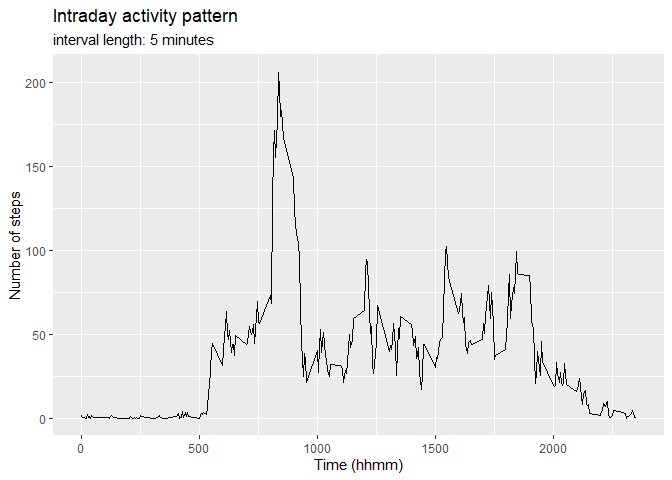

Introduction


[1] "R version 4.0.2 (2020-06-22)"

```
## -- Attaching packages --------------------------------------- tidyverse 1.3.0 --
```

```
## v ggplot2 3.3.2     v purrr   0.3.4
## v tibble  3.0.4     v dplyr   1.0.2
## v tidyr   1.1.2     v stringr 1.4.0
## v readr   1.4.0     v forcats 0.5.0
```

```
## Warning: package 'tibble' was built under R version 4.0.3
```

```
## -- Conflicts ------------------------------------------ tidyverse_conflicts() --
## x dplyr::filter() masks stats::filter()
## x dplyr::lag()    masks stats::lag()
```

```
## Warning: package 'lubridate' was built under R version 4.0.3
```

```
## 
## Attaching package: 'lubridate'
```

```
## The following objects are masked from 'package:base':
## 
##     date, intersect, setdiff, union
```

This assignment is a component of the "Reproducible Research" course by Johns Hopkins University on Coursera. 

It is now possible to collect a large amount of data about personal movement using activity monitoring devices. These type of devices are part of the "quantified self" movement - a group of enthusiasts who take measurements about themselves regularly to improve their health, to find patterns in their behavior, or because they are tech geeks. But these data remain under-utilized both because the raw data are hard to obtain and there is a lack of statistical methods and software for processing and interpreting the data.

This assignment makes use of data from a personal activity monitoring device. This device collects data at 5 minute intervals through out the day. The data consists of two months of data from an anonymous individual collected during the months of October and November, 2012 and include the number of steps taken in 5 minute intervals each day.

The raw data was provided as part of the course work. 
The repository is forked from [GitHub](http://github.com/rdpeng/RepData_PeerAssessment1).

## Loading and preprocessing the data


```r
unzip(zipfile = "activity.zip")
activity <- read.csv2("activity.csv", sep = ",", na.strings = "NA")
activity <- activity %>% mutate(date = ymd(as.character(date)))
```


```r
# create tibble with total number of steps per day
totalsteps <- activity %>% 
        group_by(date) %>% 
        summarise(total = sum(steps, na.rm = TRUE))
```

```
## `summarise()` ungrouping output (override with `.groups` argument)
```

```r
totalsum <- sum(totalsteps$total, na.rm = TRUE)
totalmean <- mean(totalsteps$total, na.rm = TRUE)
totalmedian <- median(totalsteps$total, na.rm = TRUE)
totalmin <- min(totalsteps$total, na.rm = FALSE)
totalmax <- max(totalsteps$total, na.rm = TRUE)
```


## What is mean total number of steps taken per day?

At first, we take a look at the activities.

Over the 2 month observation period, a total number of 570608 steps were recorded. 

The daily activity was not spread evenly across the period. The daily average was 9354.23 steps. The median number of steps taken was 10395. However, the daily number of steps taken varied widely, with a minimum of 0 and a maximum of 21194 steps.

The below chart shows the distribution of daily activity. 


```r
# plot a histogram of total number of steps taken each day
ggplot(totalsteps,aes(total)) +
        geom_bar(na.rm = TRUE) + 
        scale_x_binned() + 
        labs(x = "Daily number of steps", y = "Count of days", 
             title = "Distribution of total steps taken per day (n = 61 days)",
             subtitle = "Missing data set to 0 (n = 8 days)")
```

<!-- -->

```r
# Raw data NAs show up in the first bin, as set to 0.
# Would have been better to remove them from the sample before creating the plot. However, the instructions stated these could be ignored.
```


## What is the average daily activity pattern?

In a next step we take a look at the activity pattern over the course of an average day.
As can be seen, the activities start shortly after 5:00am, peak around 8:30am, start to calm down around 7:00pm, only to get close to zero around 10:00 pm.


```r
# create tibble with mean number of steps per interval
intraday <- activity %>%
        group_by(interval) %>%
        summarise(intra = mean(steps, na.rm = TRUE))
```

```
## `summarise()` ungrouping output (override with `.groups` argument)
```

```r
# plot a histogram of total number of steps taken each day
ggplot(intraday,aes(x = interval, y = intra)) +
        geom_line(na.rm = TRUE) + 
        labs(x = "Time (hhmm)", y = "Number of steps", 
             title = "Intraday activity pattern",
             subtitle = "interval length: 5 minutes")
```

<!-- -->


```r
# find most active period
maxsteps <- intraday %>%
        filter(intra == max(intra)) %>%
        mutate(stunde = interval %/% 100, minute = interval %% 100)
```
The most active 5-minute-interval starts 8 : 35.


## Imputing missing values

In a next step we consider missing values and their potential effects  on the results achieved so far. 


```r
totalnum <- sum(is.na(activity$steps))

# create tibble to analyze missing values
miss <- activity %>%
        filter(is.na(steps)) 

miss_days <- miss %>%
        group_by(date) %>% 
        count(date) 
# 8 days with 288 intervals each = 2304 observations are completely missing.
```

There are in total 2304 intervals with missing observations. For eight days all values are missing. No missing data is recorded for intervals on other days.

It might be required to impute missing values.
Given observed intraday activity pattern it seems prudent to replace missing values with the mean activity of the corresponding 5-minute intervals.


```r
# create new dataset where NAs are replaced with interval mean 
imputed <- activity %>% 
        group_by(interval) %>%
        mutate(steps = replace(steps, is.na(steps), mean(steps, na.rm = TRUE)))

# From here on missing values initially set to 0 have been replaced 
# create tibble with total number of steps per day
totalimputed <- imputed %>% 
        group_by(date) %>% 
        summarise(total = sum(steps))
```

```
## `summarise()` ungrouping output (override with `.groups` argument)
```

```r
imputedmean <- mean(totalimputed$total) 
imputedmedian <-  median(totalimputed$total) 
```


```r
# plot a histogram of total number of steps taken each day
ggplot(totalimputed,aes(total)) +
        geom_bar() + 
        scale_x_binned() + 
        labs(x = "Daily steps", y = "Number of days", 
             title = "Distribution of total steps taken per day",
             subtitle = "totaled over 2 months, missing values imputed")
```

<!-- -->

As one would expect, replacing missing values with the mean of the non-missing values moves observations to center of the distribution. Replacing missing values with mean of non-missing values leads to different results. It is worth keeping this in mind when drawing conclusions from the data. 
The new mean number of steps with imputed data is 10766.19. The new 
median number of steps with imputed data is 10766.19. 
The identity of mean and median is another consequence of our data manipulation.


## Are there differences in activity patterns between weekdays and weekends?

The activity pattern is different between weekdays (Mon - Fri) and weekends (Sat, Sun).
The peak of activities in the morning that dominates the pattern on weekdays can not be observed on weekends. Generally, the activities are more evenly spread on the weekends.   


```r
imputed <- imputed %>%
        mutate(weekday = if_else(
                wday(date,week_start = getOption("lubridate.week.start", 1)) > 5, 
                "weekend", 
                "weekday"))
```


```r
imputedintraday <- imputed %>%
        group_by(interval, weekday) %>%
        summarise(intra = mean(steps, na.rm = TRUE))
```

```
## `summarise()` regrouping output by 'interval' (override with `.groups` argument)
```

```r
ggplot(imputedintraday, aes(x = interval, y = intra )) +
        geom_line() + 
        facet_grid((rows = vars(weekday))) +
        labs(x = "Time (hhmm)", y = "Number of steps", 
             title = "Intraday activity pattern",
             subtitle = "interval length: 5 minutes")
```

<!-- -->

